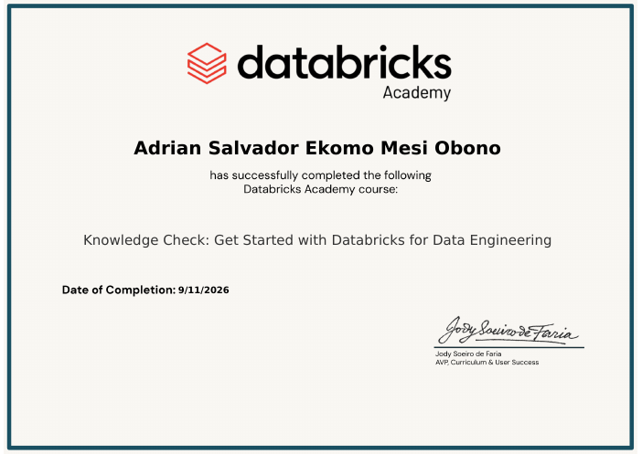

<p align="center">
  <sub>INGEST&ensp;⇢&ensp;STORE&ensp;⇢&ensp;TRANSFORM&ensp;⇢&ensp;MODEL&ensp;⇢&ensp;SERVE&ensp;⇢&ensp;MONITOR</sub>
</p>

<h1 align="center">
  
</h1>

<p align="center">
  <b>Data Engineering Student @ Esprit | DevOps → DataOps</b> — Building reliable data platforms and turning data into useful insights. Currently looking for a Junior Data Engineer opportunity.
</p>

<p align="center">
  <a href="https://linkedin.com/in/adrian-salvador-ekomo-mesi-obono-5990b8182"></a>
  <a href="mailto:adriansalvadorekomo@outlook.com"></a>
  <a href="https://github.com/adriansalvadorekomo"></a>
</p>

---

```sql
-- ABOUT ME
SELECT
  'Computer Eng. Student'        AS profile,
  'Data Eng. | Cloud & DevOps'   AS focus,
  'Esprit School of Eng.'        AS school,
  'Tunis, Tunisia'               AS location,
  'raw data > trusted decisions' AS mantra;
```

Through academic and personal projects, I've gained hands-on experience designing data pipelines, data warehouses, analytics solutions, and machine learning workflows — what hooked me is systems thinking: how data moves through a system and where it actually breaks. My solo DataOps build runs an e-commerce dataset through a **Databricks** lakehouse (Bronze/Silver/Gold medallion, data quality gates, Terraform-managed infra with PR-gated CI) from a **PostgreSQL** source. I also have professional **DevOps** experience (OpenStack, Terraform, Ansible — Open edX deployment, HA Bastion with ~5s failover), giving me a practical understanding of infrastructure and automation. My focus is the journey from raw data to structured, trustworthy information for real business decisions.

---

<p align="center">
  
  
</p>

---

### Pipeline Stack

<table>
  <tr>
    <th align="left" width="180">Layer</th>
    <th align="left">Tools</th>
  </tr>
  <tr>
    <td><b>⬇ Ingest</b></td>
    <td>    </td>
  </tr>
  <tr>
    <td><b>🗄 Store</b></td>
    <td>    </td>
  </tr>
  <tr>
    <td><b>🔁 Transform</b></td>
    <td>   </td>
  </tr>
  <tr>
    <td><b>🧠 Model</b></td>
    <td>     </td>
  </tr>
  <tr>
    <td><b>📊 Serve</b></td>
    <td>    </td>
  </tr>
  <tr>
    <td><b>📈 Monitor</b></td>
    <td> </td>
  </tr>
  <tr>
    <td><b>⚙ Deploy</b></td>
    <td>        </td>
  </tr>
  <tr>
    <td><b>💻 Languages</b></td>
    <td>  </td>
  </tr>
</table>

<sub>Core drivers: <b>SQL</b> · <b>Databricks</b> · <b>Terraform</b> — project exposure (familiar): Airflow, Airbyte, dbt — methods: Systems Thinking, Agile</sub>

---

### Projects

<details open>
<summary><b>📌 Pinned projects</b></summary>
<br />

| Project | Stack | Description |
|---------|-------|-------------|
| [**DataOps Lakehouse for E-commerce Analytics**](https://github.com/adriansalvadorekomo/smart-erp-dataopts) | `PostgreSQL` `Databricks` `Delta Lake` `Terraform` `CI` | Solo DataOps build for e-commerce — PostgreSQL source, Databricks medallion lakehouse (Bronze/Silver/Gold) with DQ gates, Terraform-managed infra, PR-gated CI. |
| [**EventZilla-BI-AI-Powered-Event-Analytics-Platform**](https://github.com/adriansalvadorekomo/Esprit-PABI-4ERPBI6-2526-EventZella) | `Talend` `Airflow` `PostgreSQL` `MLflow` `Docker` | Academic team project (6 people); my scope: integration, Docker/Nginx delivery, chatbot/API fixes. Star-schema warehouse, ML forecasting/anomaly detection, NL-to-SQL, 11 microservices. |
| [**KORIA — GabèsEye**](https://github.com/adriansalvadorekomo/KORIA) | `Flutter` `PyTorch` `scikit-learn` `Airbyte` `FastAPI` | AI-powered environmental monitoring — satellite segmentation, sensor data sync, time-series forecasting, multilingual chatbot. H12 INNOVATION 3.0. |
| [**Stage RIF — OpenStack HA Automatisation**](https://github.com/adriansalvadorekomo/Stage_ete_RIF_Automatisation) | `OpenStack` `Terraform` `Ansible` `Nginx` `Keepalived` | DevOps intern: Terraform provisioning + Ansible config of Open edX on OpenStack; HA Bastion with single Floating IP, validated PRIMARY→BACKUP failover in ~5s; secure SSH + Git pipeline. |

</details>

---

### Languages

<p>
  
  
  
  
</p>

---

### Certifications

| Certificate | Details |
|-------------|---------|
| [](certs/DEA0018198901240.pdf) | **Data Engineer Associate — DataCamp**<br/>Issued Sept 2026 · ID `DEA0018198901240`<br/>Data cleaning · ETL · SQL · normalization · cloud pipelines · data quality<br/>Exams: DE101 (timed) + DE501P (practical SQL: extraction, joins, aggregation, validation) |
| [](certs/databricks-get-started-data-engineering.pdf) | **Get Started with Databricks for Data Engineering — Databricks Academy**<br/>Issued Sept 2026<br/>Databricks lakehouse fundamentals for data engineering<br/>Click the certificate to view the credential |
| [](certs/SQA0019633928960.pdf) | **SQL Associate — DataCamp**<br/>Issued Sept 2026 · ID `SQA0019633928960`<br/>Click the certificate to view the credential |
| [](certs/PDA0019443332398.pdf) | **Python Data Associate — DataCamp**<br/>Issued Sept 2026 · ID `PDA0019443332398`<br/>Data analysis with Python: managing, cleaning, visualizing data · Pandas<br/>Exams: PY101 (timed) + PY501P (practical business problem) |
| [](certs/prompt-engineering-cognitive-class.pdf) | **Prompt Engineering for Everyone — Cognitive Class (IBM Skills Network)**<br/>Issued July 2026 · `AI0117EN`<br/>Prompt design and LLM interaction fundamentals<br/>[Verify credential](https://courses.cognitiveclass.ai/certificates/f447a067ccea4a395d461e2c2f5b3c6cc) |

---

### CV — Multi-Language

<p>
  <a href="cv/Adrian_Salvador_Ekomo_CV_EN.pdf"></a>
  <a href="cv/Adrian_Salvador_Ekomo_CV_ES.pdf"></a>
  <a href="cv/Adrian_Salvador_Ekomo_CV_FR.pdf"></a>
  <a href="cv/Adrian_Salvador_Ekomo_CV_DE.pdf"></a>
</p>

---

<p align="center">
  <i>Data Engineering Student | DevOps → DataOps | Databricks · Terraform · PySpark · SQL</i>
  <br />
  <sub>Built with ✦ for the data that drives decisions</sub>
</p>
