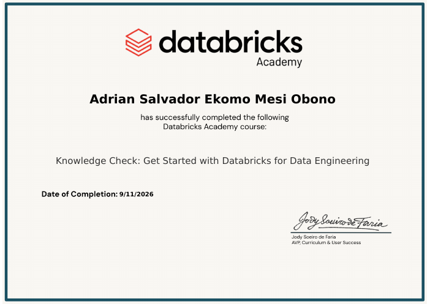

<p align="center">
  <sub>REPRODUCIBLE INFRA&ensp;⇢&ensp;QUALITY-GATED CI/CD&ensp;⇢&ensp;GOVERNED DATA PIPELINES</sub>
</p>

<h1 align="center">
  
</h1>

<p align="center">
  <b>Engineering student building the platforms that data and ML workloads run on.</b><br/>
  <sub>Seeking a <b>Data Platform / Data Engineering / DevOps internship</b> · Leipzig, Germany · Available from December 2026</sub>
</p>

<p align="center">
  <a href="https://linkedin.com/in/adriansalvadorekomo"></a>
  <a href="mailto:adriansalvadorekomo@outlook.com"></a>
  <a href="https://github.com/adriansalvadorekomo"></a>
  <a href="https://adriansalvadorekomodev.vercel.app"></a>
</p>

---

```sql
-- ABOUT ME — mirrors my English CV
SELECT
  'Engineering student (ESPRIT + Marburg)' AS profile,
  'Data Platform | Data Eng | DevOps'      AS seeking,
  'Leipzig, Germany — from Dec 2026'       AS location,
  'Reproducible infra over manual steps'   AS mantra;
```

I eliminate manual, error-prone steps where infrastructure, CI/CD and data intersect: reproducible infrastructure with Terraform + Ansible, quality-gated CI/CD with Jenkins + SonarQube, and governed data pipelines with Databricks + Spark and Airflow / Prefect. Proof below — each build reconciles, fails fast, or recovers fast.

---

<p align="center">
  
  
</p>

---

### Technical Skills

<table>
  <tr>
    <th align="left" width="220">Group</th>
    <th align="left">Stack</th>
  </tr>
  <tr>
    <td><b>Platform &amp; Infrastructure</b></td>
    <td>     </td>
  </tr>
  <tr>
    <td><b>Delivery &amp; Automation</b></td>
    <td>   </td>
  </tr>
  <tr>
    <td><b>Containers &amp; Orchestration</b></td>
    <td>  </td>
  </tr>
  <tr>
    <td><b>Data Engineering</b></td>
    <td>      </td>
  </tr>
  <tr>
    <td><b>Pipelines &amp; Observability</b></td>
    <td>     </td>
  </tr>
  <tr>
    <td><b>Programming</b></td>
    <td>   </td>
  </tr>
</table>

<sub>Core drivers: <b>SQL</b> · <b>Databricks</b> · <b>Terraform</b> — methods: Systems Thinking, Agile</sub>

---

### Featured Builds — 5 CV projects only (pin these)

> Pin order on my profile matches this table. Unpinned everything else (KORIA, forks, school exercises).

| Project | Stack (CV terms) | What it proves |
|---------|------------------|----------------|
| [**DataOps Lakehouse for E-commerce Analytics**](https://github.com/adriansalvadorekomo/DataOps-Lakehouse-for-E-commerce-Analytics) | `PostgreSQL` `Databricks` `PySpark` `Terraform` `PR-gated CI` | Solo medallion lakehouse Bronze → Silver → DQ gate → Gold, Terraform-managed, end-to-end green, reconciling **99.4M** synthetic revenue. |
| [**EventZilla — BI + AI Event Analytics**](https://github.com/adriansalvadorekomo/EventZilla-BI-AI-Powered-Event-Analytics-Platform) | `Airflow` `MLflow` `n8n` `Docker` `Nginx` `Prometheus` `Grafana` | 6-person team: star-schema warehouse from 3 sources, Prophet forecasting (**MAPE <15%**), 11 Dockerized microservices, Airflow + n8n automation. |
| [**Project Management App — 10-stage CI/CD to K8s**](https://github.com/adriansalvadorekomo/DevOps-AppGestionDesProjets) | `Spring Boot` `Angular` `MySQL` `Jenkins` `SonarQube` `Docker Compose` `Kubernetes` | 5-service Compose (healthy-MySQL gate, env secrets, no public DB port) + 10-stage Jenkins (SonarQube Quality Gate blocks release, immutable `:build-N`, curl-verified redeploy), ported to minikube. |
| [**Customer Churn MLOps**](https://github.com/adriansalvadorekomo/customer-churn-mlops) | `Python` `Prefect` `pytest` `ruff` `bandit` | Notebook → scheduled pipeline: pure logic separated, 6 pytest gates, 3 staggered flows (02/04/06 UTC), **85.5% accuracy** (2k holdout), churn recall 0.42 documented. `uv run python main.py`. |
| [**RIF Internship — OpenStack HA Automatisation**](https://github.com/adriansalvadorekomo/Stage_ete_RIF_Automatisation) | `OpenStack` `Terraform` `Ansible` `Nginx` | Remote DevOps for 10+ engineers: Terraform VMs/networks/Floating IPs + idempotent Ansible (Docker, UFW, proxy), containerized Open edX + HTTPS/DuckDNS, PRIMARY→BACKUP bastion **~5s failover**, Git-reviewed. |
| Spark notebooks | `PySpark` `Spark SQL` `Spark Streaming` | Public notebooks on GitHub (see DataOps repo + gists). |

---

### Experience

**RIF – Rassemblement des Ingénieurs Francophones | DevOps Intern · France (Remote) · Jul 2026 – Sep 2026**
- Replaced hand-built servers with code (Terraform + Ansible), shipped Open edX reproducibly, 5s bastion failover.

### Education

- **ESPRIT School of Engineering** — Engineering, Computer Science ERP-BI / Data Engineering (5th year) · Sep 2022 – Dec 2026
- **Philipps-Universität Marburg** — Exchange (Freemover), Mathematics & Computer Science · Oct 2026 – present

---

### Certifications — only the 4 on my CV

| Certificate | Details |
|-------------|---------|
| [](certs/DEA0018198901240.pdf) | **Data Engineer Associate — DataCamp**<br/>Issued Sept 2026 · ID `DEA0018198901240`<br/>Cleaning · ETL · SQL · normalization · cloud pipelines · quality<br/>DE101 + DE501P (practical SQL) |
| [](certs/databricks-get-started-data-engineering.pdf) | **Get Started with Databricks for Data Engineering — Databricks Academy**<br/>Issued Sept 2026<br/>Lakehouse fundamentals |
| [](certs/SQA0019633928960.pdf) | **SQL Associate — DataCamp**<br/>Issued Sept 2026 · ID `SQA0019633928960` |
| [](certs/PDA0019443332398.pdf) | **Python Data Associate — DataCamp**<br/>Issued Sept 2026 · ID `PDA0019443332398`<br/>Pandas · cleaning · visualization<br/>PY101 + PY501P |

---

### Languages — matches CV

<p>
  
  
  
  
</p>

---

### CV — EN / ES / FR synced from vault (DE coming soon)

<p>
  <a href="cv/Adrian_Salvador_Ekomo_CV_EN.pdf"></a>
  <a href="cv/Adrian_Salvador_Ekomo_CV_ES.pdf"></a>
  <a href="cv/Adrian_Salvador_Ekomo_CV_FR.pdf"></a>
  
</p>
<sub>EN/ES/FR are the current vault versions (Leipzig, Dec 2026). German lands later — badge stays disabled until then.</sub>

---

<p align="center">
  <i>Data Platform · Data Engineering · DevOps | Databricks · Terraform · PySpark · SQL</i>
  <br />
  <sub>Built with ✦ for the data that drives decisions</sub>
</p>
